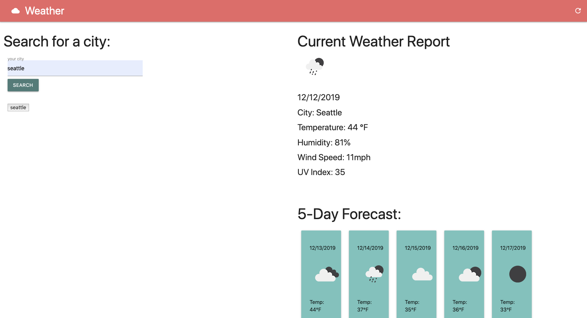

# Unit 06: Weather Dashboard

# Table of Contents (Optional)
N/A

# Installation
View website. https://alexahanthony.github.io/weather-app/

View Github Repository. https://github.com/alexahanthony/weather-app

# Usage
This website allows you to view the weather of any city in the world. It gives you the current date, weather, and 5 day forcast. You can search for multiple cities and the cities you search for are stored locally and on the page for you to click and easily view the weather again. 

# Credits
There were no collaborators, (other than classmates and teacher feedback).

# Third-party assets: 
https://materializecss.com/ for styling

https://openweathermap.org/api for the weather server-side API

https://momentjs.com/ for time 3rd party CDN

https://www.w3schools.com/ for help with styling

https://stackoverflow.com/ for help with syntax

# License
N/A

# Badges
N/A

# Contributing
N/A

# Tests
N/A

